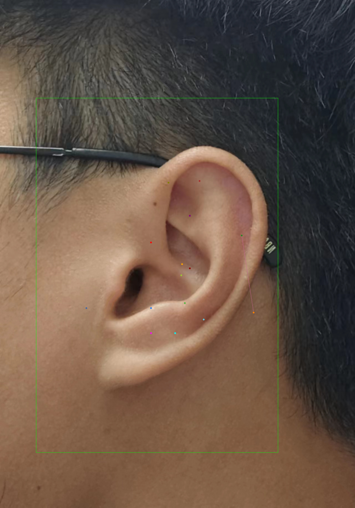

# 这里是 MMPose 的作业

目标检测 mAP: 0.531 (70 epoch)

关键点检测 mAP: 0.018 (80 epoch)

助教用 [colab](https://colab.research.google.com/drive/1DnGQ8e5I2iSpz_tEgWnjpakhFYstlR4G?usp=sharing) 完成的作业，供大家参考

踩坑的过程请看笔记 [《MMPose in Colab实践》](https://www.yuque.com/voyagerx/ksbopk/mqbg5gl2deq9bd9q?singleDoc# )

关键点检测结果

